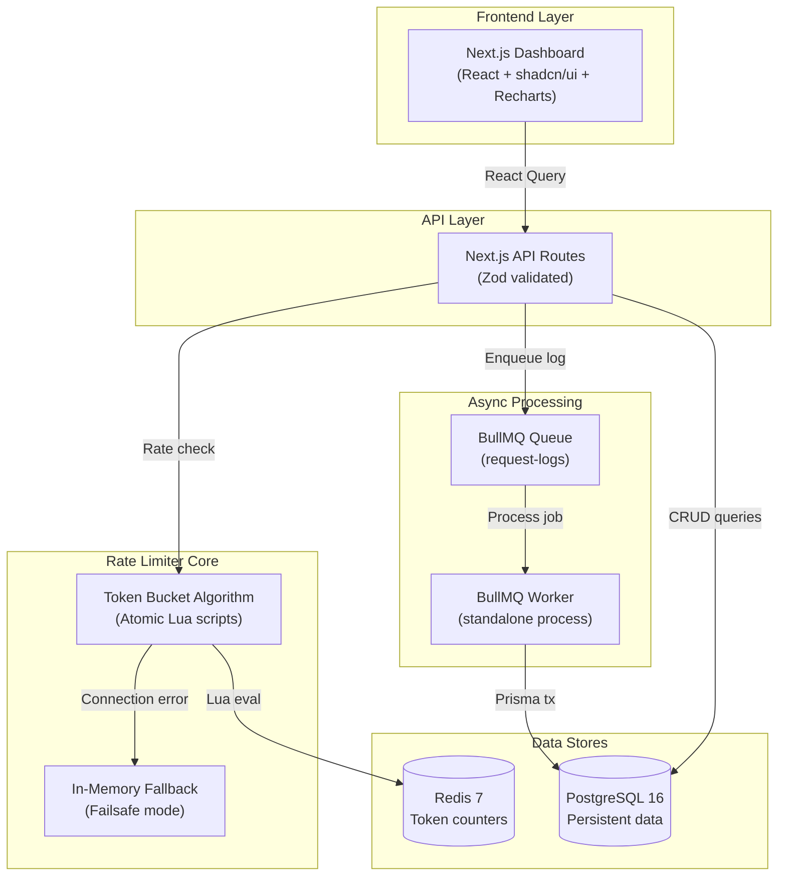
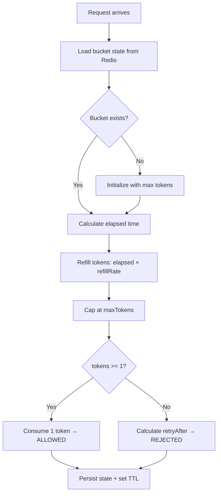
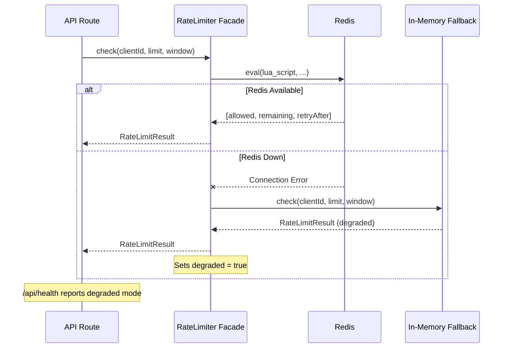
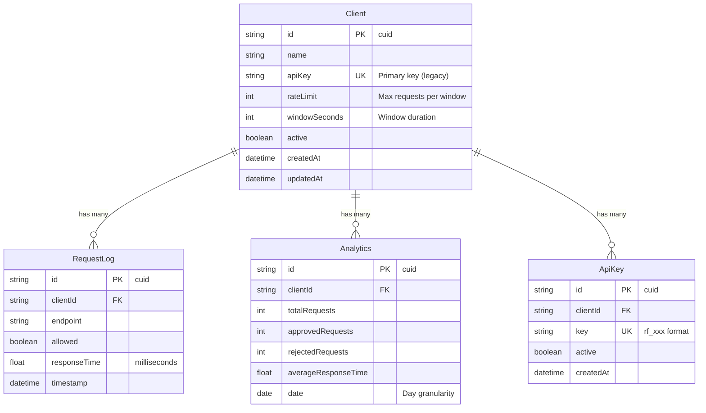
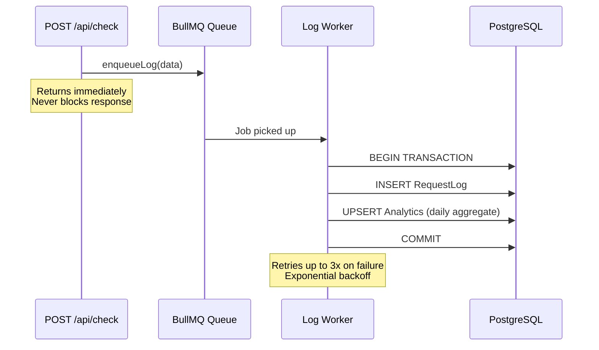

# RateFlow — Architecture Documentation

## System Overview

RateFlow is a High Availability distributed Rate Limiter Service that sits between client applications and third-party APIs. It decides whether requests should be allowed based on configurable per-client rate limits.

## Architecture Diagram

## Token Bucket Algorithm

The token bucket is a rate limiting algorithm that:

1. Each client has a "bucket" with a maximum number of tokens
2. Tokens are consumed on each request (1 token per request)
3. Tokens refill at a constant rate: `maxTokens / windowSeconds` per second
4. If the bucket has >= 1 token, the request is allowed
5. If the bucket is empty, the request is rejected with a `retryAfter` value

### Why Token Bucket?

- **Smooth rate limiting**: Unlike fixed windows, token bucket allows bursts up to the limit
- **No boundary issues**: No sudden resets at window boundaries
- **Atomic operations**: Lua script runs entirely inside Redis — no race conditions

### Lua Script Flow

## Failsafe Architecture

## ER Diagram

## Async Log Processing

